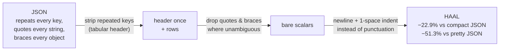

<div align="center">

# Haaland

**HAAL: a token-efficient serialization language for LLM context windows.**

The JSON data model, losslessly, at a fraction of the tokens — because the fastest,
cheapest token is the one you never send.

[](https://github.com/adhyaay-karnwal/haaland/actions/workflows/ci.yml)
[](https://www.python.org)
[](LICENSE)

[Quickstart](docs/quickstart.md) ·
[Spec](docs/spec.md) ·
[Benchmarks](benchmarks/RESULTS.md) ·
[LLM integration](docs/llm-integration.md) ·
[Agent prompts](prompts/) ·
[Enterprise guide](docs/enterprise.md)

</div>

---

## The idea: from token speed to token efficiency

The industry optimizes how *fast* models emit tokens. The other lever is how *few*
tokens the same information needs. Most tokens flowing through production LLM systems
are not prose — they are serialized records, API results, logs, and tables, wrapped in
JSON that repeats every key for every row and bills you for every quote and brace.

HAAL is a plain-text serialization of the exact JSON data model, designed so that BPE
tokenizers produce as few tokens as possible:

```python
import haaland

users = {"users": [
    {"id": 1, "name": "Ada Lovelace",  "role": "admin",  "active": True},
    {"id": 2, "name": "Grace Hopper",  "role": "editor", "active": True},
    {"id": 3, "name": "Alan Turing",   "role": "viewer", "active": False},
]}

print(haaland.dumps(users))
```

```
users[3]{id,name,role,active}:
 1,Ada Lovelace,admin,true
 2,Grace Hopper,editor,true
 3,Alan Turing,viewer,false
```

Keys are written once per array, not once per element. No quotes, braces, or brackets
unless removing them would change the data. `loads(dumps(x)) == x` for every
JSON-representable value — key order included — verified by property-based tests
across tens of thousands of random documents.

## Measured results

All numbers are **measured, not estimated**, on six deterministic datasets modeling
real LLM-context payloads (uniform records, nested orders, event logs, timeseries,
deep config, RAG chunks), tokenized with the public `o200k_base` vocabulary.
Reproduce with `python benchmarks/run.py`. Full tables: [benchmarks/RESULTS.md](benchmarks/RESULTS.md).

| Format | Total tokens (6 datasets) | vs. compact JSON |
|---|---:|---:|
| JSON (2-space, what most people paste) | 30,549 | +58.5% |
| YAML | 23,686 | +22.9% |
| JSON (compact) | 19,272 | baseline |
| **HAAL** | **14,860** | **−22.9%** |

Per-dataset, against the *strongest* baseline (compact JSON):

| Dataset (shape) | JSON | HAAL | Savings |
|---|---:|---:|---:|
| `events_200` — API/event log records | 6,522 | 4,081 | **−37.4%** |
| `employees_100` — uniform database rows | 4,732 | 3,107 | **−34.3%** |
| `rag_chunks_30` — retrieval chunks + metadata | 2,371 | 2,105 | −11.2% |
| `orders_50` — nested orders with line items | 4,561 | 4,435 | −2.8% |
| `timeseries_48h` — numeric metric arrays | 858 | 873 | +1.7% |
| `config` — small deeply-nested object | 228 | 259 | +13.6% |

We publish the losses too: on small, deeply-nested payloads with no repeated
structure, compact JSON wins. HAAL targets the payloads that dominate real token
bills — **arrays of records**. Against pretty-printed JSON (the de-facto default in
prompts), HAAL measures **−51.3%** overall.

> **Tokenizer scope.** `o200k_base`/`cl100k_base` (OpenAI) are the only production
> BPE vocabularies that are public and runnable offline, so those are what we measure.
> Other vendors' tokenizers (e.g. Anthropic's) differ; the structural savings
> (deduplicated keys, no quote/brace tokens) carry over mechanically, but exact
> percentages will differ. We ship
> [`benchmarks/run_anthropic.py`](benchmarks/run_anthropic.py) so you can measure
> real Claude token counts against your own API key rather than trust an extrapolation.

## Why it saves tokens



1. **Tabular arrays.** A uniform array of objects declares its fields once
   (`users[3]{id,name,role}:`) and then emits bare rows. JSON pays for every key,
   quote, colon, and brace on every element.
2. **Quoting only when required.** Strings are written bare unless that would change
   the parse; the spec defines exact per-context rules, so it stays lossless.
3. **Cheap structure.** Newline + 1-space indentation merges into few BPE tokens;
   `{`, `}`, `",`, `":` typically don't. Both the 1-space indent and the comma
   delimiter are the **measured optima** from committed ablation runs
   ([design notes](docs/design-notes.md)).
4. **Verifiable by design.** `[N]` length markers and field headers make truncated or
   hallucinated structure detectable at parse time — which matters when the *producer*
   of the document is an LLM. The decoder validates all of it strictly.

## Install

```bash
pip install git+https://github.com/adhyaay-karnwal/haaland.git
# with token-counting extras:
pip install "haaland[tokens] @ git+https://github.com/adhyaay-karnwal/haaland.git"
```

The core package has **zero dependencies**.

## Use

**Python** (mirrors `json`):

```python
import haaland

text = haaland.dumps(data)          # encode  (indent=1, delimiter="," defaults)
data = haaland.loads(text)          # decode, strictly validated
```

**CLI** (files or stdin, composable):

```bash
curl -s https://api.example.com/users | haal encode        # JSON -> HAAL
haal decode data.haal                                      # HAAL -> JSON
haal check data.haal                                       # validate, line-numbered errors
haal stats data.json                                       # measure your own savings
```

`haal stats` on your own payload is the recommended first step — it prints real token
counts for JSON, pretty JSON, and HAAL under both public tokenizers.

**In a prompt** — put the schema rules in your system prompt and pass data as HAAL.
Ready-made, tested prompt blocks live in [`prompts/`](prompts/):

- [`prompts/system-prompt.md`](prompts/system-prompt.md) — teach a model to read/write HAAL
- [`prompts/agent-setup.md`](prompts/agent-setup.md) — paste into your AI coding agent to integrate HAAL into your codebase for you

## When to use it (and when not to)

| Payload | Recommendation |
|---|---|
| Arrays of records: DB rows, API results, logs, CSV-ish data | **Use HAAL** — 30–40% measured savings |
| RAG chunks with metadata | Use HAAL — ~11% measured savings |
| Mixed nested documents | Use HAAL — small wins; flatten where possible |
| Small deep config objects, pure numeric arrays | Compact JSON is equal or better — HAAL's `[N]` validation costs a few tokens |
| Function-calling / structured *output* where the API enforces JSON schema | Keep JSON — the platform requires it |

## Documentation

| | |
|---|---|
| [docs/quickstart.md](docs/quickstart.md) | Install → first conversion → first prompt in 5 minutes |
| [docs/spec.md](docs/spec.md) | The formal format specification (v0.1) |
| [docs/format-by-example.md](docs/format-by-example.md) | Every construct, JSON side-by-side |
| [docs/llm-integration.md](docs/llm-integration.md) | Prompt patterns, LLM-emitted HAAL, validation loops |
| [docs/enterprise.md](docs/enterprise.md) | Cost modeling, rollout strategy, risk assessment |
| [docs/design-notes.md](docs/design-notes.md) | Ablation data; ideas we measured and rejected |
| [docs/faq.md](docs/faq.md) | Common questions, honest limitations |
| [benchmarks/](benchmarks/) | Reproducible harness + committed results |

## Related work

HAAL is not the first attempt at token-efficient serialization —
[TOON](https://github.com/toon-format/toon) explores the same insight (tabular
key-folding for LLM contexts), and CSV/TSV have always been the degenerate flat case.
HAAL's contribution is the combination of: a strict validation-first decoder with a
lossless round-trip guarantee (property-tested), defaults chosen by committed ablation
measurements rather than intuition, and published results that include the shapes
where the approach loses. See [docs/faq.md](docs/faq.md#how-is-this-different-from-toon)
for a comparison.

## Contributing

Issues and PRs welcome — see [CONTRIBUTING.md](CONTRIBUTING.md). The bar for merging:
tests pass, `ruff` clean, benchmark claims backed by committed harness output.

## License

[MIT](LICENSE)
